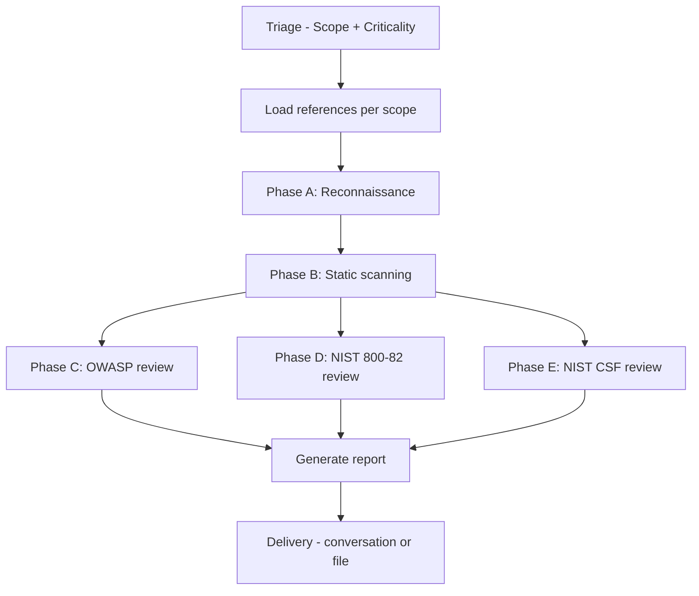

# Spring Boot Integration Auditor 🔒

> Skill de opencode para auditoría de seguridad en integraciones Spring Boot. Verifica código contra **NIST SP 800-82** (seguridad ICS/OT), **OWASP Top 10 (2021)** y **NIST CSF 2.0**.

---

## ¿Qué hace?

Analiza estáticamente proyectos Spring Boot 3.x para detectar vulnerabilidades en integraciones industriales y empresariales. Ideal para entornos OT (minería, manufactura, energía) donde una falla de seguridad puede afectar a sistemas de control físico.

**Cobertura:** 3 marcos normativos simultáneamente — NIST 800-82 para OT, OWASP Top 10 para web, NIST CSF 2.0 para madurez organizacional.

---

## Casos de uso

| Situación | Aplicación |
|-----------|-----------|
| 🏭 Pre-producción | Auditar un microservicio Spring Boot antes de deploy a producción |
| 📋 Auditoría externa | ISO 27001, NIS2, PCI-DSS, SOX, NERC-CIP |
| 🔧 Hardening legacy | Modernizar apps Spring Boot 2.x con configuración insegura |
| 🔍 Due diligence técnico | Evaluar software Spring entregado por un proveedor |
| 🛡️ Respuesta a incidentes | Investigar si la app fue vector de ataque |
| 🤝 M&A | Evaluación de riesgo en código heredado |

---

## Frameworks auditados

| Framework | Enfoque | Controles |
|-----------|---------|-----------|
| **OWASP Top 10 2021** | Web application security | A01-A10: Broken Access Control, Injection, Crypto, Auth, SSRF... |
| **NIST SP 800-82 Rev 3** | ICS/OT security | 20+ controles (AC, IA, SC, SI, SR) + checks OPC UA / MQTT / Modbus |
| **NIST CSF 2.0** | Organizational maturity | 6 funciones (GV/ID/PR/DE/RS/RC) con subcategorías mapeadas |

---

## Stack soportado

| Componente | Versión | Notas |
|-----------|---------|-------|
| Java | 17 LTS, 21 LTS | < 17 → hallazgo medio |
| Spring Boot | 3.x | 2.x (EOL Nov 2023) → hallazgo alto |
| Spring Security | 6.x | Config lambda (sin `WebSecurityConfigurerAdapter`) |
| Spring Data JPA | 3.x | Hibernate 6.x |
| Eclipse Milo | 1.x | Cliente OPC UA (ICS) |
| HiveMQ MQTT | 1.x | Cliente MQTT (ICS) |
| j2mod | 3.x | Cliente Modbus (ICS) |

---

## Estructura del skill

```
spring-boot-integration-auditor/
├── SKILL.md                  ← Orquestador (este skill)
├── logic/
│   └── triage.md             ← Diagnóstico de alcance + criticidad
├── references/
│   ├── owasp-top-10.md       ← Checks A01-A10 con patrones Spring
│   ├── nist-800-82.md        ← Controles ICS mapeados a Spring Boot
│   ├── nist-csf-2.0.md       ← Funciones GV/ID/PR/DE/RS/RC
│   ├── spring-boot-patterns.md ← Fragmentos vulnerable vs seguro
│   └── report-template.md    ← Plantilla de reporte final
```

---

## Flujo de ejecución



1. **Triage** — Determina qué auditar, criticidad operacional y alcance
2. **Reconocimiento** — Escaneo no destructivo: estructura, stack, endpoints, seguridad
3. **Escaneo estático** — OWASP Dependency-Check, búsqueda de secretos, inyecciones, deserialización insegura
4. **Revisión por framework** — Mapea hallazgos a controles específicos de cada normativa
5. **Reporte** — Genera documento con scorecard, hallazgos por severidad, plan de remediación

---

## Clasificación de severidad

| Severidad | Técnico | Operacional (por criticidad) |
|-----------|---------|------------------------------|
| **Critical** | CVSS ≥ 9.0, RCE, bypass auth, secretos expuestos | Puede detener producción, comprometer seguridad física, exponer datos OT |
| **High** | CVSS 7.0–8.9, inyección, broken access control, SSRF | Acceso no autorizado a sistemas core, exposición de datos de producción |
| **Medium** | CVSS 4.0–6.9, misconfig, dep vulnerables sin exploit conocido | Hardening insuficiente, logging incompleto |
| **Low** | CVSS < 4.0, documentación, optimización | Mejora recomendada sin riesgo inmediato |

---

## Reglas de engagement

| Regla | Descripción |
|-------|-------------|
| **No destructivo** | Nunca modificar código, configs ni ejecutar la app |
| **Evidencia obligatoria** | Cada hallazgo incluye `archivo:línea` + snippet exacto |
| **Sin falsos positivos** | Si hay duda, marcar "requiere verificación manual" |
| **Stack detection** | Si no es Spring Boot, detener e informar |
| **Full scope en High/Critical** | Sugerir alcance completo incluso si el usuario pide Quick |

---

## Resultado

El reporte incluye:

- **Executive summary** (3–5 líneas)
- **Compliance scorecard** (% por framework + conteo por severidad)
- **Hallazgos detallados** ordenados por severidad (Critical → Low)
- **Tablas de cumplimiento** por framework
- **Plan de remediación** (24h / 72h / 30d / 90d)
- **Apéndice** con comandos ejecutados y su salida
- **Sign-off** con roles (Auditor, Tech Lead, Security Lead, CISO si aplica)

---

## Prerrequisitos

- `pom.xml` o `build.gradle` con `spring-boot-starter-*`
- Java 17+ disponible (no requiere ejecutar la app)
- Opcional: `mvn`, OWASP Dependency-Check, `gitleaks`, `trivy`, `snyk`

---

## Licencia

Apache 2.0 — Ver [LICENSE](LICENSE) para más detalles.

---

## Referencias

- [OWASP Top 10 2021](https://owasp.org/Top10/)
- [NIST SP 800-82 Rev 3](https://csrc.nist.gov/pubs/sp/800/82/r3/final)
- [NIST CSF 2.0](https://www.nist.gov/cyberframework)
- [Spring Security Reference](https://docs.spring.io/spring-security/reference/)
- [OWASP Dependency-Check](https://owasp.org/www-project-dependency-check/)
